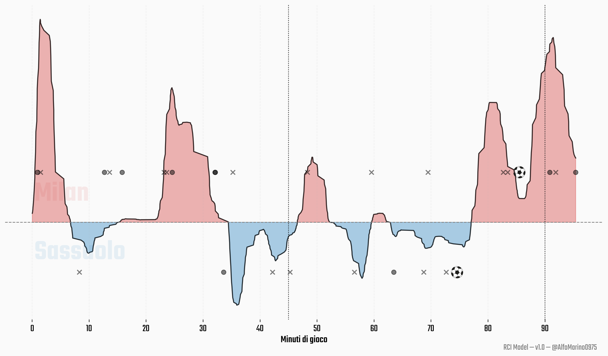

# Match Momentum – RCI Viewer  
Web-app interattiva sviluppata in **Python + Streamlit** per visualizzare il **Match Momentum** delle partite di calcio, basato sul modello di **Real Control Index** (RCI). 
L'RCI è un indice che misura il controllo reale delle squadre nei match, che ha come base il modello di xT e determinati eventi adeguatamente pesati.



---

## Obiettivo del progetto

L’app consente di:

- Visualizzare il **Match Momentum** per qualsiasi partita del dataset.
- Mostrare graficamente **aree di dominio** delel squadre.
- Evidenziare su una **linea eventi unica** gol e tiri.
- Selezionare partite tramite una UI intuitiva:
    - **campionato → squadra → partita** tramite un'interfaccia intuitiva.
- Personalizzare il livello di smoothing della curva.
- Generare grafici ad alta qualità ed esportarli in PNG.
- Analizzare graficamente le fasi della partita dominate da ciascuna squadra.

Il modello RCI è pensato come **alternativa interpretabile** ai metodi proprietari di Match Momentum utilizzati da broadcaster e provider (Opta, StatsBomb, StatsPerform).  
L’obiettivo è fornire una rappresentazione del controllo di gara coerente sia con l’analisi quantitativa sia con la prospettiva cognitiva della *situation awareness*.

---

## Struttura del progetto

📦 streamlit_match_momentum

┣ 📜 app.py
 
┣ 📜 df_matches.parquet
 
┣ 📜 momentum_data.h5
 
┣ 📜 ball_icon.png

┣ 🗂️ fonts
 
┣ 📜 requirements.txt
 
┗ 📜 README.md


---

## Come avviare localmente

```bash
pip install -r requirements.txt
```

```bash
streamlit run app.py
```

L'interfaccia sarà disponibile su http://localhost:8501

---

## Fonte dei dati

I dataset utilizzati in questo progetto sono rilasciati sotto licenza CC BY 4.0 e sono pubblicamente disponibili su figshare:

- Pappalardo, Luca; Massucco, Emanuele (2019): Soccer match event dataset. figshare. Collection.
https://doi.org/10.6084/m9.figshare.c.4415000.v5


