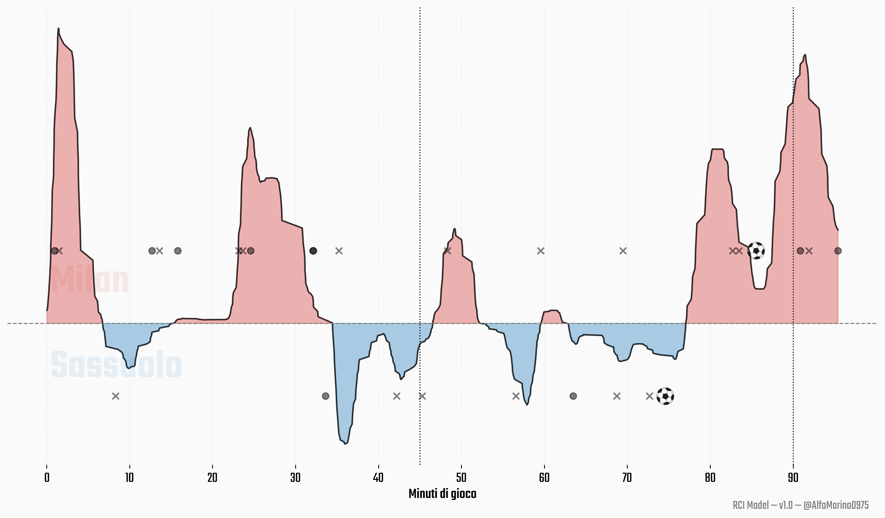

# Match Momentum | RCI Viewer

A **Streamlit** application for visualising football match momentum using the **RCI (Relative Control Index)** model on Wyscout 2017/2018 data.

For every match, the app renders a momentum curve showing which team dominated play minute by minute, overlaid with goals and shot events.

---

## Preview




> *Select a league → team → match, adjust the smoothing slider, click **Show Match Momentum**.*

The chart shows:
- **Red area** — home team dominance
- **Blue area** — away team dominance
- **⚽** — goal (ball icon, side indicates which team scored)
- **●** — shot on target
- **×** — shot off target

---

## Project Structure

```
streamlit-match-momentum/
│
├── app.py                    # Main Streamlit application
│
├── df_matches.parquet        # Match registry (git-ignored)
├── momentum_data.h5          # HDF5 momentum data (git-ignored)
├── ball_icon.png             # Goal marker icon (optional)
│
├── fonts/                    # Teko font family (optional)
│   ├── Teko-Regular.ttf
│   ├── Teko-Medium.ttf
│   └── Teko-SemiBold.ttf
│
├── requirements.txt
├── .gitignore
└── README.md
```

---

## Data Files

The two binary data files are **not included** in the repository (see `.gitignore`).

### `df_matches.parquet`

Match registry — one row per team per match.

| Column | Type | Description |
|---|---|---|
| `matchId` | int | Unique match identifier |
| `teamName` | str | Team name |
| `home_away` | str | `"h"` = home, `"a"` = away |
| `league` | str | Competition name (optional) |

### `momentum_data.h5`

HDF5 file — one group per match (group name = `matchId`).

| Dataset | Shape | Description |
|---|---|---|
| `minutes` | (N,) | Minute timestamps |
| `diff` | (N,) | Raw RCI differential (home − away) |
| `goals_minutes` | (G,) | Minute of each goal |
| `goals_team` | (G,) | Team name for each goal (bytes) |
| `shots_minutes` | (S,) | Minute of each shot |
| `shots_team` | (S,) | Team name for each shot (bytes) |
| `shots_on_target` | (S,) | 1 = on target, 0 = off target |

---

## Installation

```bash
git clone https://github.com/marinoalfonso/streamlit_match_momentum.git
cd streamlit_match_momentum

python -m venv venv
source venv/bin/activate        # Windows: venv\Scripts\activate
pip install -r requirements.txt
```

### Optional: custom fonts

Download the [Teko font family](https://fonts.google.com/specimen/Teko) from Google Fonts and place the `.ttf` files in a `fonts/` folder. The app falls back to matplotlib's default font if the folder is absent.

---

## Usage

```bash
streamlit run app.py
```

Then open [http://localhost:8501](http://localhost:8501) in your browser.

### Controls

| Control | Description |
|---|---|
| **Select league** | Filter matches by competition (if column is present) |
| **Select team** | Show only matches involving the chosen team |
| **Select match** | Pick a specific match (labelled as Home vs Away) |
| **Smoothing level** | Gaussian sigma applied to the raw RCI curve (3–15) |
| **Show Match Momentum** | Render the chart |
| **Download chart** | Save the current figure as a 300 dpi PNG |

---

## RCI Model

The **Relative Control Index** is a minute-by-minute metric that quantifies which team is controlling the match. Positive values indicate home team dominance, negative values indicate away team dominance.

The raw signal is smoothed with a Gaussian filter — the sigma parameter is exposed to the user via the slider, allowing different levels of detail.

> Data source: Wyscout open event data, seasons 2017/2018.

---

## Requirements

| Package | Purpose |
|---|---|
| `streamlit` | Web application framework |
| `pandas` | Data loading and filtering |
| `numpy` | Array operations |
| `matplotlib` | Chart rendering |
| `h5py` | HDF5 file reading |
| `scipy` | Gaussian smoothing |
| `pyarrow` | Parquet file backend |

---

## License

MIT License — see [LICENSE](LICENSE).  
Wyscout data is used under their open data license for academic and non-commercial research.
- Pappalardo, Luca; Massucco, Emanuele (2019): Soccer match event dataset. figshare. Collection.
https://doi.org/10.6084/m9.figshare.c.4415000.v5

